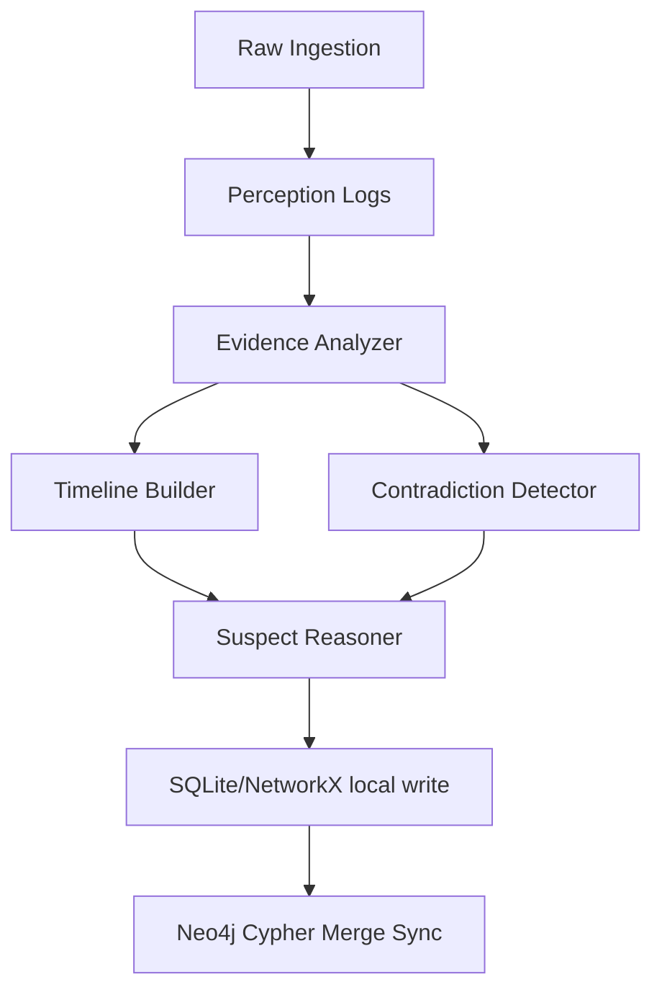

# Sentinel AI: Multi-Agent Crime Investigation System

An autonomous, multi-modal cognitive crime scene investigation assistant. Sentinel AI leverages stateful, cyclic multi-agent orchestration (LangGraph) and computer vision (YOLOv8) to automate evidence ingestion, sequence chronological timelines, flag testimony contradictions, and rank suspects.

---

## 🚀 Key Features

*   **Multi-Modal Evidence Ingestion:** Handles raw uploads of witness statement text files, audio recordings, and CCTV camera footage (.mp4).
*   **Computer Vision Perception:** Features an OpenCV frame-sampling pipeline integrated with a YOLOv8 Nano object detection model to filter and log key entities (people, vehicles, carried bags) with confidence scores and exact timestamps.
*   **Stateful Agent Orchestration:** Uses **LangGraph** to compile a cyclic reasoning mesh of four role-specific sub-agents:
    1.  **Evidence Analyzer:** Extracts suspects, items, locations, and testimony details.
    2.  **Timeline Builder:** Sequences all event logs chronologically.
    3.  **Contradiction Detector:** Identifies logical discrepancies across different witness statements and CCTV logs.
    4.  **Suspect Reasoner:** Evaluates motives, means, and opportunities to rank suspects.
*   **Dual-Persistence Storage:** Keeps local relational database records in **SQLite**, builds in-memory graphs in **NetworkX**, and automatically synchronizes relation topologies to a live **Neo4j** enterprise cluster in real-time.
*   **Offline/Air-Gapped Mode:** Supports offline client routing via local **Ollama** servers to run reasoning loops completely secure and offline.

---

## 📂 Project Structure

```text
├── backend/
│   ├── agents/
│   │   ├── __init__.py
│   │   ├── orchestrator.py    # LangGraph StateGraph compiled workflow
│   │   └── sub_agents.py      # Sub-agents prompt templates & model router
│   ├── db.py                  # SQLite, NetworkX, and Neo4j sync adapters
│   ├── main.py                # Reference FastAPI REST endpoints
│   └── perception.py          # OpenCV frame capture and YOLOv8 inference
├── frontend/
│   └── app.py                 # Streamlit UI dashboard and state tracker
├── uploads/                   # Local storage for witness texts & downloaded videos
├── extra/                     # Case datasets downloaders and schedule helpers
├── Dockerfile                 # Packages the app with system libs (OpenCV/GLib)
├── requirements.txt           # Python packages list
├── .gitignore                 # Excludes local databases, weights, and secret keys
├── .env.example               # Environment variables template
└── README.md                  # SURE Trust student template README
```

---

## 🛠️ Quick Start

### 1. Prerequisites
Ensure you have Python 3.10+ installed on your system.

### 2. Install Dependencies
Install all required libraries, including LangGraph, OpenCV, PyTorch, and Ultralytics:
```bash
pip install -r requirements.txt
```

### 3. Configure Credentials
Copy the example environment file to `.env` and fill in your keys:
```bash
cp .env.example .env
```
Inside `.env`:
*   Add your `GROQ_API_KEY` (Llama 3.3) or `GEMINI_API_KEY` (Gemini 1.5 Flash).
*   *(Optional)* Configure your `NEO4J_URI` and `NEO4J_PASSWORD` if syncing with a live Neo4j database.
*   *(Optional)* Set `USE_OLLAMA=true` to run offline using a local Ollama model instance.

### 4. Run the Streamlit Dashboard
Start the application with a single command:
```bash
python -m streamlit run frontend/app.py
```
Open **[http://localhost:8501](http://localhost:8501)** in your web browser.

---

## 🐳 Docker Deployment

The application is fully containerized. The `Dockerfile` includes the necessary system libraries (Mesa OpenGL and GLib) required to run headless OpenCV and YOLOv8 on Linux containers.

1.  **Build the Docker Image:**
    ```bash
    docker build -t sentinel-ai .
    ```
2.  **Run the Container:**
    ```bash
    docker run -p 8501:8501 --env-file .env sentinel-ai
    ```

---

## ⚙️ Technical Details

### YOLOv8 Frame Sampling Optimization
In `backend/perception.py`, raw video files are captured via OpenCV. To prevent CPU bottlenecks on standard machines, the parser samples the video at a rate of **1 frame per second** (instead of 30). Detections are filtered for classes `person`, `car`, `truck`, `bicycle`, `backpack`, `handbag`, and `suitcase`. Detections above a **50% confidence threshold** are logged.

### Multi-Agent Flow Diagram

